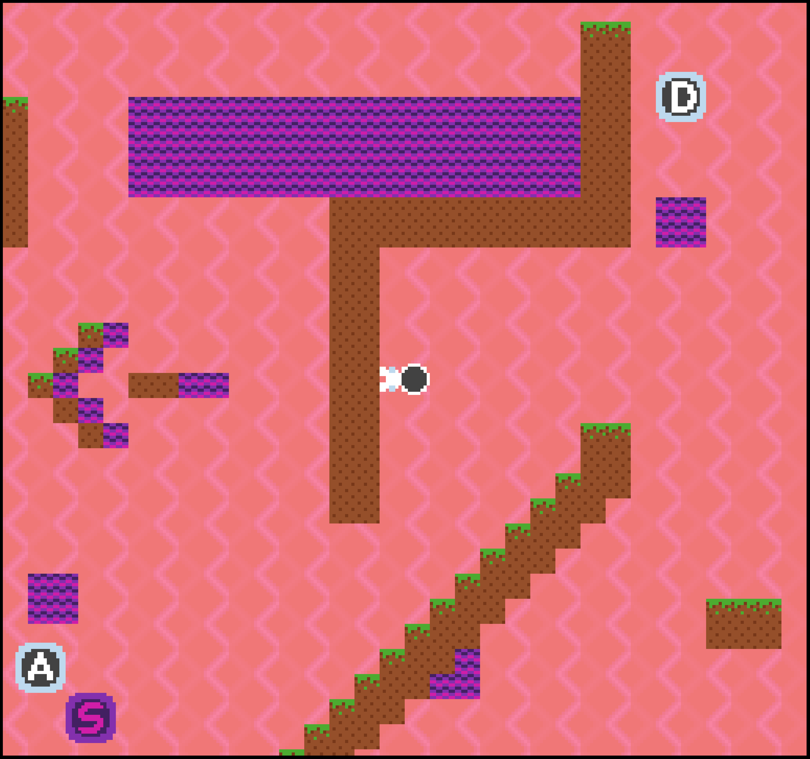

# Gravity

This is a game for the Computer Game Programming class at Carnegie Mellon University (15-466), and is based on the starter code available here: https://github.com/15-466/15-466-f23-base1

Author: Matei Budiu

Design: Gravity is a puzzle platformer with the game mechanic of collectible gravity tokens, enabling the player to change the direction of gravity to navigate a level.

Screen Shot:

How Your Asset Pipeline Works:

All assets in this game are stored as PNG images in the data folder, and were manually created with GIMP. There are a few different asset types:
1. Texture files: these determine tile and sprite textures. Texture files are all stored and read in 4 colors, with the red channel indicating the
first bit of the palette and green indicating the second bit. Textures are read in 8 pixel x 8 pixel sections, enabling for some bigger game objects
which require multiple sprites to use the same image file.
2. Palette files: these are 2x2 images which store color palettes used for textures and sprites in regular PNG pixel color form. 
The x and y positions correspond to the 1st and 2nd palette bit of the textures. These can also be stitched together and read in sections.
3. Level file: this is a large file whose pixels are turned into tiles in the level. Each pixel's color defines the type of tile in game.
The level file is parsed all at once and stored in its own data structure, and only parts of it are sent to the PPU for display, as
the level is larger than a PPU background. The sections sent to the PPU depend on the player's position.

Everything I drew is located in the data folder of the dist folder and is used as input for the game. 

How To Play:

The scope of the game is to find the golden coin in the level without touching purple anti-matter, which results
in having to start over.

The player controls the little astronaut in the center of the screen with the arrow keys. 
The arrow keys perpendicular to the current gravity result in walking, and the key against gravity results in jumping.

Throughout the level, there are 3 different gravity tokens with letters on them. Collecting these tokens unlocks new
directions of gravity. Once you have collected your first token, you can change gravity using the keys displayed
in the bottom left of the screen (WASD). You can only change gravity when you are standing on ground.

The gravity mechanic can be a bit tricky to master. If you feel like you are stuck somewhere, maybe try changing 
the gravity to discover a new route.

This game was built with [NEST](NEST.md).

To play the game, you must run the game executable from the dist directory with the data folder. The executable for
Mac OS is included in the repository.
